# 简易面向对象数据库Beauty设计与开发


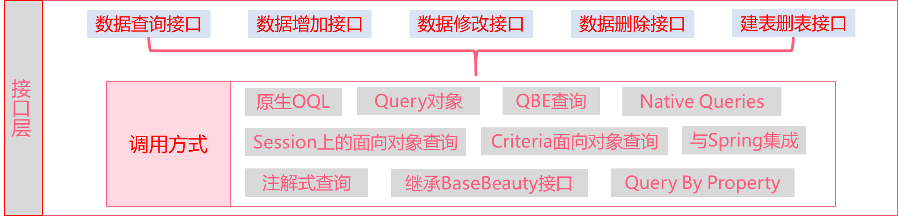

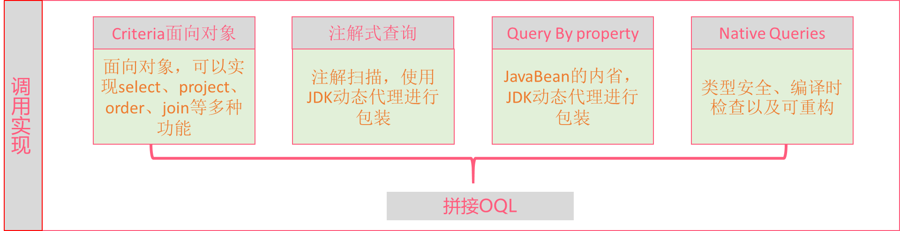

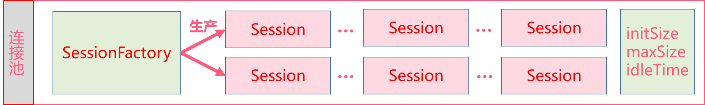

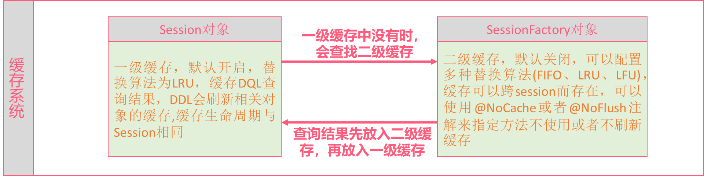

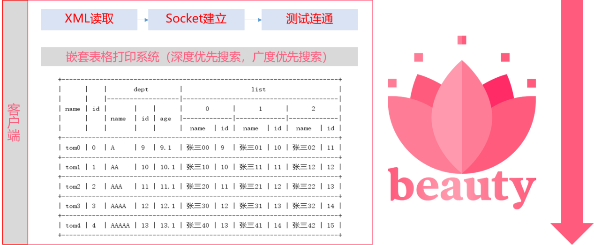

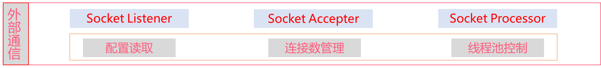

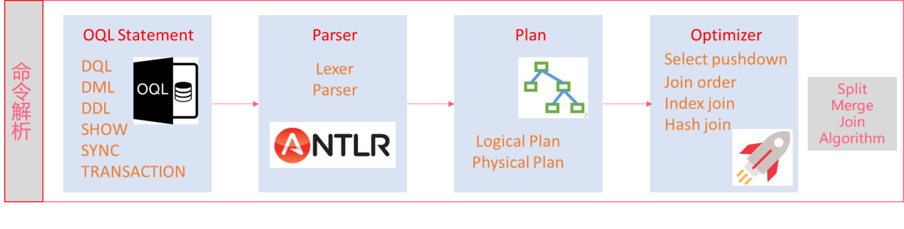

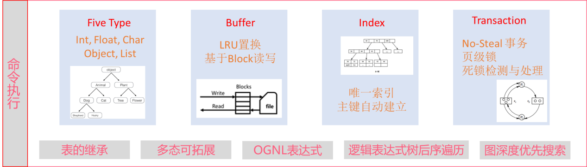

  * [**简易面向对象数据库Beauty**设计与开发](#简易面向对象数据库beauty设计与开发)
    * [1. RDBMS的局限](#1-rdbms的局限)
    * [2. O/R 映射](#2-or-映射)
    * [3. ORM存在的问题](#3-orm存在的问题)
    * [4. 设计理念](#4-设计理念)
    * [5. 名称及Logo含义解释](#5-名称及logo含义解释)
    * [6. 系统整体架构](#6-系统整体架构)
    * [7. 数据组织形式](#7-数据组织形式)
    * [8. 数据块缓冲池](#8-数据块缓冲池)
    * [9. 目录管理](#9-目录管理)
    * [10. 五种数据类型](#10-五种数据类型)
    * [11. 索引机制](#11-索引机制)
    * [12. 事务管理](#12-事务管理)
    * [13. 读写锁的实现](#13-读写锁的实现)
    * [14. 死锁的检测与处理](#14-死锁的检测与处理)
    * [15. OGNL表达式](#15-ognl表达式)
    * [16. Object Query Language](#16-object-query-language)
    * [17. OQL解释器](#17-oql解释器)
    * [18. 逻辑执行计划](#18-逻辑执行计划)
    * [19. Split-Merge Algorithm](#19-split-merge-algorithm)
    * [20. 物理执行计划](#20-物理执行计划)
    * [21. 基于流水线的迭代器算法](#21-基于流水线的迭代器算法)
    * [22. 服务端与客户端通信](#22-服务端与客户端通信)
    * [23. Session与SessionFactory](#23-session与sessionfactory)
    * [24. 连接池管理](#24-连接池管理)
    * [25. 两级缓存系统](#25-两级缓存系统)
    * [26. 原生OQL查询与Query对象](#26-原生oql查询与query对象)
    * [27. Query By Example](#27-query-by-example)
    * [28. Native Queries](#28-native-queries)
    * [29. Criteria面向对象查询](#29-criteria面向对象查询)
    * [30. 全注解式查询](#30-全注解式查询)
    * [31. 继承BaseBeauty接口](#31-继承basebeauty接口)
    * [32. Query By Property](#32-query-by-property)
    * [33. 本系统的贡献](#33-本系统的贡献)
    * [34. 总结与展望](#34-总结与展望)


## **简易面向对象数据库Beauty**设计与开发

### 1. RDBMS的局限

学过关系型数据库的人都知道，关系模型要求关系必须是规范化的，即要求关系必须满足一定的规范条件，这些规范条件中最基本的一条就是，关系的每一个分量必须是一个不可分的数据项，即不允许表中套表，这也就是耳熟能详的数据库设计第一范式。

在大学期间，第一范式一直是我们设计数据库必须遵循的一条金科玉律，实际上我们也必须这样做，因为现有的RDBMS，比如SQL
Server、MySQL、Oracle等都是这么设计的，如果我们不遵循这个条件，数据库便不能够创建成功。

但是，当我们把目光转到面向对象的程序设计上来，面向对象讲究一切皆为对象，对象与对象之间的关系有六种：继承、实现、依赖、关联、聚合、组合。这其中的关联、聚合、组合都表现为一个对象把另一个对象当做自己的一个属性，因此在面向对象的程序设计中，对象的属性并不要求非得是不可分的数据项，而可以是其它的复杂对象，或者对象的集合，即列表。

例如，我们要表示一个学生对象，这个学生的属性有学号、姓名、年龄、所在的学校和要上的课程，其中，学校是个有编号和名称的复杂对象，课程也是个有课程号和名称的复杂对象，而且一个学生拥有多门课程。按照面向对象的程序设计原则，我们设计出来的UML类图如下图所示，其中，学生跟课程，学生跟学校，都是聚合关系，课程是个列表类型。

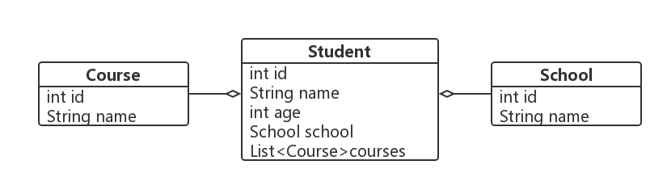

我们都知道，程序运行时，对象是存储在内存中的，等程序运行结束，或者机器断电之后，内存中的数据就丢失了，为了能把对象持久性地保存下来，使我们能够在下一次开机或者在其它机器上能够恢复这个对象，我们必须要把对象序列化到存储设备中。简单来说，我们可以把对象序列化到普通的文件中，但是更常见、更高效、更安全的方式还是将对象存储在数据库中。

但是这样就出问题了，我们期待数据库能够把我们的对象按照下面表格的形式存储下来，但是数据库设计的第一范式明确规定了表中的每一个分量必须是一个不可分的数据项，即不能表中套表，所以使用传统的RDBMS，我们无法将这个对象存入数据库。

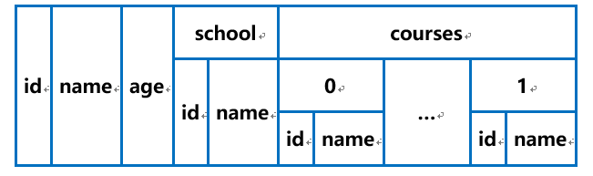

### 2. O/R 映射

为了能把一个复杂对象塞入数据库，很多学者和程序员想出了各种各样的方法，其中最有效认可度最高的方式就是O/R映射（Object Relation Mapping），即不破换第一范式的规则和面向对象的设计原则，把对象按照属性进行拆分，把一个完整的对象拆成多个实体，实体之间可以有1:1、1:n、n:m等多种联系形式，如下图所示：

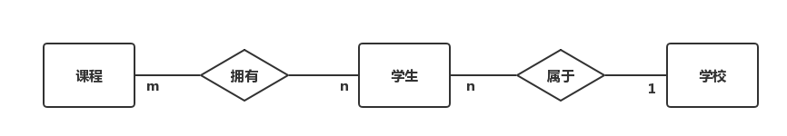

设计数据库的时候一个实体转化为一个表，其中1:1、1:n的联系可以转化成一个独立的表，也可以跟n端的那个表进行合并，n:m的表必须转化成一个独立的表，表与表之间使用外键进行关联。将一个对象存储到这样的多个表中，读取对象的时候利用多表查询的方式，从多个表中读取数据，再拼装成相关对象。按照这种思路，设计的数据库的如下图所示：

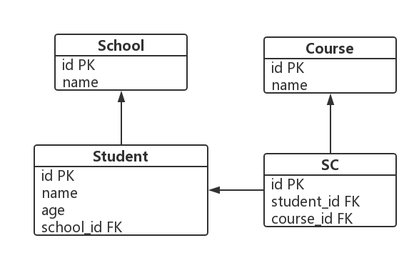

当需要查询数据时，可以使用多表查询语句，比如要查询学号为1的学生信息时，可以使用如下语句：


查询出数据后，再从结果集中取出相应的字段，拼装成相应的对象，如果程序中使用原生JDBC的话，我们需要手动拼接对象，方式如下：

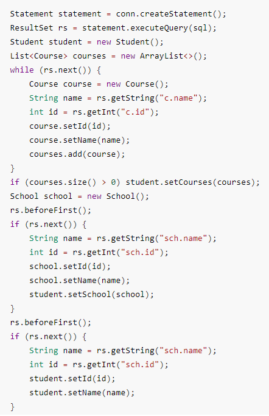

而现在比较流行的持久层框架，如Mybatis、Hibernate等，都支持使用配置文件的方式来自动完成ORM。例如在Mybatis中，可以通过如下配置文件完成对象的拼装：

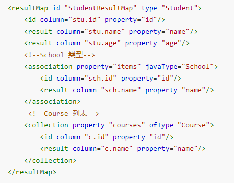

在Hibernate中，可以通过如下配置文件完成对象的拼装：

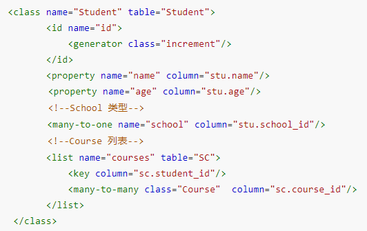

### 3. ORM存在的问题

尽管采用上述ORM方式能够将复杂对象存储到数据库中，而且有的框架已经做得比较完备了，但是离完美还是有一定距离的，最明显的就是原本是一个完整的对象，存储却用了多个表，从多个表中查询出结果之后，还要再封装成一个对象，中间这个拆分合并的环节难免会让人感到非常繁琐。上面举的这个例子还好，因为学校和课程还可能被其他学生引用，拆分成多个表，数据库的设计可以满足第二范式，能减少表中数据的冗余，但是一些组合关系，比如鸟有两个翅膀，这两个翅膀不能离开鸟而单独存在，也就是说一个鸟诞生之后，它的两个翅膀便确定了，这两个翅膀是这只鸟独有的，不会被其他鸟所引用，这时如果再去拆分表的话，是不能减少数据冗余的，相反还会增大数据库设计的复杂性。

出现上述现象的直接原因就是数据库设计的第一范式规定我们设计表时每个字段都得是不可分的数据项，不能表中套表。

数据库第一范式的设计理念是好的，它能使我们的数据库表的冗余度尽量地小，并且关系代数和其他四个范式也是建立在第一范式的基础之上的，他们共同构成了关系型数据库强大的数学理论基础。

第一范式没有错，我们也必须要遵循，之所以出现上述问题，我认为是SQL和现在普遍使用的RDBMS把这个规范理解得太死了，做得太过于僵化了。没错，数据库表中每个字段都必须是不可分割的数据项，我们肯定不能把一大坨东西都塞入这个字段中，但是任何对象，无论它多么复杂，最终还是由一些简单变量int、float、char等组成的，因此我们完全可以允许SQL或者数据库表中出现复杂对象字段或者列表字段，只是我们把对象往文件里存的时候，由DBMS引擎将这些复杂对象逐层拆分成简单对象就可以了。

### 4. 设计理念

上一小节中已经说到了，任何对象，无论它多么复杂，最终还是由一些简单变量int、float、char等组成的。当对象的属性出现其他对象的时候，递归便出现了，也就是说，对象本身就是递归定义的，当我们把对象看成是一棵树的树根的话，对象的各个属性便构成了这棵树的各个子树，我们还是拿之前讨论过的student对象来看，这个对象的树形表示如下图所示：

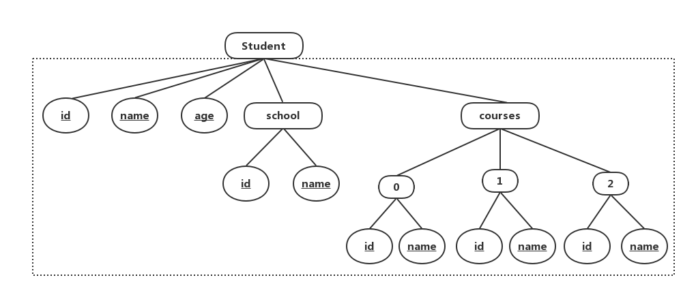

图中虚线框圈出来的就是student对象的属性，id、name、age均为简单属性，school是一个复杂类型，courses是一个列表类型，而这些复杂属性也是由简单属性构成的，这些属性构成了一片森林，我们可以称之为属性森林，属性森林中所有的中间节点均为复杂类型，所有的叶节点均为简单类型。

我们的文件中是不能存储复杂类型的，复杂类型需要拆分成简单类型，为了得到构成student对象的所有简单类型，我们需要对这片属性森林进行遍历，将遍历得到的简单属性从左向右排列，就得到了简单属性构成的列表，例如我们将上面的属性森林进行深度优先遍历，得到的简单属性列表如下：

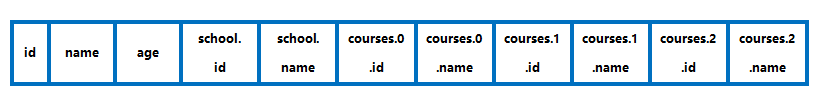


将对象进行了这样的拆分之后，每个属性就是不可分的数据项了，也就满足数据库设计第一范式了。因此，我们的SQL和数据库表的设计对外完全可以表现为可以有复杂属性，但是将对象往文件里面存储的时候，还是遵循第一范式的，只是这个对象的拆分和合并操作已经交给数据库引擎来完成了，极大地简化了程序员的操作，再看下表，我们设计数据库只需要考虑蓝色填充的部分，即属性森林的第一层，下面的拆分工作都已经交给数据库引擎来完成了，这就是面向对象的数据库beauty的设计理念。

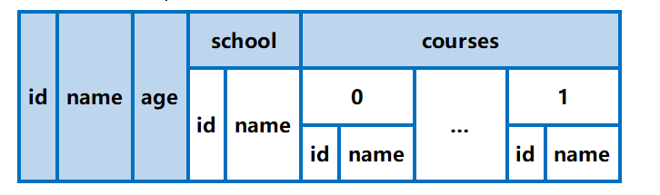

### 5. 名称及Logo含义解释

我把我设计并实现的这个简易的数据库系统叫做beauty，原因就是它比较完美地解决了对象/关系映射的问题，程序员无需手动映射，无需编写繁重的xml配置文件，设计数据库的时候也无需设计多个表，无需考虑表与表之间的联系之类的事情，这个数据库系统使得很多工作变得非常简洁，非常美丽，正如beauty一样。

下图是我设计的这个数据库系统的Logo，整体颜色为粉色，代表着beauty的简洁美丽，主体部分是一个张开的花瓣，像仓库一样，代表数据库可以存储数据，上方是一粒粒粉色的颗粒，代表我们往数据库中存储数据的时候可以直接放入一个完整的对象，无需做拆分工作。


### 6. 系统整体架构

本系统的整体架构如下：


可以看到，本系统除了自定义了一种与SQL不同的语言OQL(Object Query Language)和将对象属性写入文件的方式与普通RDBMS不同外，其他模块基本与普通的RDBMS相同。

本系统自下而上为对象的持久化提供了一整套的解决方案，下到OQL解析、执行计划生成、文件存储、索引建立、事务管理，上到丰富的API调用、连接池、两级缓存、与spring无缝集成等，旨在让数据库的操作尽可能地简单，让程序的持久层DAL(Database Access Layer)代码尽可能得少，从而使程序员能将更多的精力放在业务逻辑代码中，进而能大大提高开发效率。

### 7. 数据组织形式

由于磁盘的IO速度非常慢，如果每次操作都只从文件读取一条数据，处理完后也每次只向文件中写入一条数据，肯定会严重拖慢系统的响应速度，考虑到现代计算机的内存大小都比较可观了，一般都是4GB以上，又根据数据的局部性原理：一旦程序访问了一条数据，那么这条数据附件的数据也有很大的概率被访问到，典型的情况就是数据库查询过程中有大量的顺序扫描（Sequence Scan）。所以我们的每次操作不用以单条数据为单位，而是以数据块（Block）为单位，一个数据块中有多条记录，对一条记录读写的时候直接将这条数据所在的数据块全部调入内存，写回文件的时候也是将一整个数据块全部写回，这样能减少IO的时间，提高响应速度。


如上表所示，这便是记录在Block中的组织形式，一个Block中可以存储n个Record，其中:

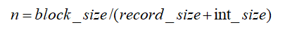

我们规定本系统中记录的大小不会超过一个Block的大小，因此n一定是大于1的。每个record_size加上这个int_size对应了上图中绿色填充的部分，这是标识记录是否有效的标识位，后面会解释。有了Block之后，一个表便可以划分成多个block了，我们通过表对应的文件和块在文件中的偏移量，便能唯一定位到一个块，即fileName和BlockNo便能唯一确定一个Block，这样，当我们知道一个记录的偏移量tupleOffset时（即这是表中的第几条记录），这个记录所在的块和块内偏移量可以由如下公式来确定：

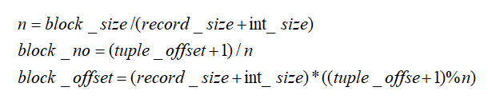

其中，tuple_offset加1的原因是，第一个Block的第一个record不用，这个后面会解释，这样我们便能得到这条记录所在的块和块内的偏移量了，从这个位置读取或者写入数据便能操作这条记录了。

每个Record_size加上一个int_size的原因是，本系统要在每条记录前面加上一个int类型的标志位，表示这条记录是否有效，以实现后续的删除功能。如果没有这个标志位的话，删除中间的一条记录需要将后面所有的记录向前移动，这是非常耗费时间和性能的。而加了这一个标志位之后，删除一条记录，只需要将这个标志位改为已被删除就好了，检索记录的时候先读取这个标志位，如果检测到已经被删除，就跳过这条数据，因为可以大大提高删除操作的性能。

这样做虽然可以提高性能，但是却会浪费空间，因为删除并不是把这条记录真正从文件中抹去了，这个已被删除的记录还是存在于文件中，存储空间并没有被释放，长期使用会导致数据文件过于庞大，解决这个问题，可以采取以下两种方法：

1.  定期“紧凑”。紧凑就是将后面的数据向前移动，覆盖被删除的数据，用有效的数据填补删除数据后留下的“坑”，可以单独创建一个定时任务来进行紧凑，也可以在每次插入数据的时候进行紧凑。但是，紧凑还是会涉及到记录的移动，还是会浪费时间损耗性能，因此本系统没有采用这种方式。

2.  构建空闲记录表（Free List）。空闲记录表就是一个链表，串接了所有已被删除的记录，刚刚也提到了，我们的每条记录前面都有一个标志位，来标识这条记录是否已被删除，为了能正确构建空闲记录表，我们可以这样来设计这个标志位，标志位为负值的时候，表示记录有效，当记录被删除的时候，我们把这个标志位改成它所连接的下一个空闲记录的指针（即下一个空闲记录的tupleOffset），这个tupleOffset是一个正数，空闲记录表的结尾用0来标识。第一个Block的第一条记录不用，用来表示空闲记录表的起点，这就是上面公式里面tupleOffset要加1的原因，每删除一条记录，就采用“头插法”将这个记录插入空闲记录表中，如下图所示：

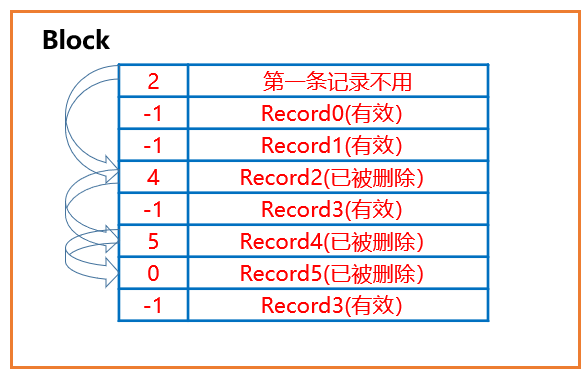

这样，我们新插入一条数据的时候，先从空闲记录表的起始位置（第一个Block的第一条记录开始），看看这个table中是否存在被删除的记录，如果存在，将要插入的数据写入这个已被删除的记录的位置就可以了，由于本系统设计的单个表的每条记录长度都是相等的，因此这样插入不会出现错误，用新插入的记录去覆盖已经被删除的记录，这样就不会出现空间浪费文件膨胀的问题了，这也是被本系统所采用的一种方式。

### 8. 数据块缓冲池

在本系统中，一个Block只存储一个表中的数据，也就是一个Block中不会出现多个表中的记录。为了能在内存中同时存在多个表的Block，提高程序内存中Block的命中率，本系统在内存中同时存在N个block。每次对一条记录读取或者修改的时候，先看包含这条记录的Block是否已经调入内存中，有的话称为Block命中，直接用这个Block就行了，没有的话就会发出数据块调入请求，程序会将相应的Block从文件调入内存，如果内存中现有的Block数量小于规定的最大Block数量N，则可以直接调入，如果内存中现有的Block数量大于等于规定的最大Block数量N，则要执行Block替换算法。

常见的替换算法有先进先出（FIFO）、最近最久未使用（LRU）、最近使用次数最少（LFU）等，它们的设计思想和实现方式如下：

1.  FIFO

>   FIFO(First In，First
>   Out)按照先进先出的原理淘汰数据，正好符合队列的特性，数据结构上可以使用队列Queue来实现。

1.  新访问的数据插入FIFO队列尾部，数据在FIFO队列中顺序移动；

2.  淘汰FIFO队列头部的数据。

3.  LRU

>   LRU(Least recently
>   used)算法根据数据的历史访问记录来进行淘汰数据，其核心思想是“如果数据最近被访问过，那么将来被访问的几率也更高”，最常见的实现是使用一个链表保存缓存数据。

1.  新数据插入到链表头部；

2.  每当缓存命中（即缓存数据被访问），则将数据移到链表头部；

3.  当链表满的时候，将链表尾部的数据丢弃。

4.  LFU

>   LFU(Least frequently
>   used)算法根据数据的历史访问频率来淘汰数据，其核心思想是“如果数据过去被访问多次，那么将来被访问的频率也更高”。LFU的每个数据块都有一个引用计数，所有数据块按照引用计数排序，具有相同引用计数的数据块则按照时间排序。

1.  新加入数据插入到队列尾部（因为引用计数为1）；

2.  队列中的数据被访问后，引用计数增加，队列重新排序；

3.  当需要淘汰数据时，将已经排序的列表最后的数据块删除。

综合考虑以上几种替换算法，FIFO实现最简单，但是命中率也是最低的，LRU和LFU的命中率比较高，但是LFU的实现比较繁琐。因此在数据库缓冲池中我们规定的替换算法是LRU，在上层API调用的两级缓存系统中我们可以允许用户指定置换算法。

有了这个数据块缓冲池之后，我们对记录所有的操作都可以改成对记录所在的数据块的读写了，不需要直接操作文件，但是我们要给每一个Block加一个标识位dirty，代表这个Block中的数据是否被修改过，如果只是对Block进行了select之类的读操作，那么这个Block被替换出去的时候无需向文件同步数据，但是如果对Block进行了insert、update、delete之类的写操作，就必须要修改这个dirty标识，代表里面的数据被修改了，那么这个Block被替换出去的时候就必须向文件同步数据，并且在程序关闭的时候也需要将内存中所有的dirty的Block全部同步到文件中，这样就能保证我们数据不会丢失。

综上，这个数据库缓冲池（Buffer）极大提高了系统的响应速度，并且使得与文件的交互也变得简单了，后文还会介绍，这个Buffer对实现No-Steal的事务也有很大的帮助。

### 9. 目录管理

本系统的文件类型共有三种，分别是目录文件，后缀名为.catalog；记录文件，后缀名为.beauty文件；索引文件，后缀名为.index文件。其中，目录文件记录了数据库表的目录信息，比如表的名字、属性、长度、记录总数、索引信息等等。在程序启动的时候，此文件中的信息会被全部加载进入内存，形成一个Catalog类，此类中有一个Map，存储了系统中所有的表。此外，这个Catalog类还提供了建表、删表、获取某张表、获取某张表的某个属性、获取某张表的某个属性的偏移，增加删除索引等功能，在程序运行结束或者数据同步线程触发或者用户手动发送SYNC命令时，这个类中的数据会同步到.catalog文件中，保证数据不会丢失。

### 10. 五种数据类型

本系统支持5种数据类型，除了三种简单数据类型int、float、char之外，还支持复杂对象类型object，和列表类型list，5种数据类型皆继承自抽象类Attribute，UML类图如下图所示：

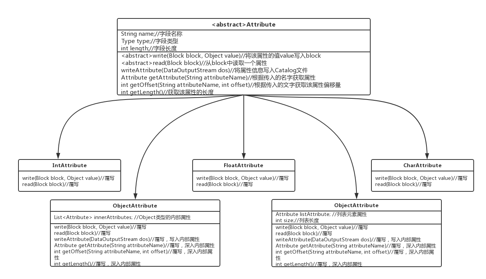

抽象类Attribute提供了5个子类共有的属性和方法，其中两个抽象方法：read和write，分别表示从block中读取该属性的数据和向block中写入该属性的数据，这两个方法必须在子类中覆写，因为只有具体知道了是哪种属性，才能知道怎么去读和怎么去写。此外，子类还可以按照需要添加属性，例如ObjectAttribute需要添加innerAttributes属性代表复杂对象内部的属性，ListAttribute需要添加listAttribute属性和size属性，分别代表列表内部元素的类型和列表的大小，子类也可以按照需要覆写父类Attriute中的方法，比如ObjectAttribute和ListAttribute均覆写了getAttribute，getAttribute，getLength等方法，因为这两个是复杂对象，实现这些功能均需要深入到其内部属性中。

这种继承方式给我们后续的设计提供了极大的方便，因为我们不用再去关心具体的属性是什么，我们只知道它是一个Attribute，我们只需要调用Attribute类中的方法，实际执行过程中借助多态，可以使我们调用的方法根据具体的属性表现出不同的行为。

这种设计思想实际上是采用了面向对象的23种设计模式中的“组合模式”，即将对象组合成树形结构以表示“部分-整体”的层次结构，组合模式使得用户对单个对象和组合对象的使用具有一致性。因为上文中也提到过，对象的属性可以用一片属性森林来表示，int、float、char等简单类型是树叶，对象和列表等复杂类型是中间节点。我们这5种属性的设计与这个思路是相同的，IntAttribute、FloarAttribute、CharAttribute是树叶，而ObjectAttribute和ListAttribute是中间节点，他们又可以把其它属性作为自己的孩子，比如ObjectAttribute有一个属性是innerAttributes，这是一个Attribute类型的列表，也就是说ObjectAttribute可以包含其它属性，这些属性可以是以上5种属性中的任意一种。这种设计模式也使我们的程序具有高度的可拓展性，因为当我们需要增加一种属性的时候，只需要增加一个Attribute类的子类就可以了，因为程序中对不同类型的选择是借助于多态而不是if-else或者switch-case。

### 11. 索引机制

创建索引可以大大提高数据库系统的性能，具体来说有以下优点：

1.  通过创建唯一性索引，可以保证数据库表中每一行数据的唯一性；

2.  可以大大加快数据的检索速度；

3.  可以加速表和表之间的连接；

4.  可以显著减少查询中分组和排序的时间。

一个成熟的数据库系统必须支持索引机制，常见的索引有B+树索引和Hash索引，由于Hash索引只支持等值查询和精确匹配，不具有普适性，因此本系统采用B+树索引。

B+树索引又分为聚簇索引和非聚簇索引两类，聚簇索引和非聚簇索引的根本区别是表中记录的物理顺序和索引的排列顺序是否一致。

聚簇索引的表中记录的物理顺序与索引的排列顺序一致，如下图1所示。索引的每一个叶节点就是一条记录，优点是查询速度快，缺点是对表进行修改的时候性能较低，因为需要对数据进行重排序。

非聚簇索引表中记录的物理顺序与索引的排列顺序不一致，如下图2所示。索引的叶节点并不是真实的物理记录，而是指向物理记录的指针，优点是对表修改的时候性能较高，无需对数据重排序，缺点是查询速度稍慢于聚簇索引，因为需要指针的二次定位。

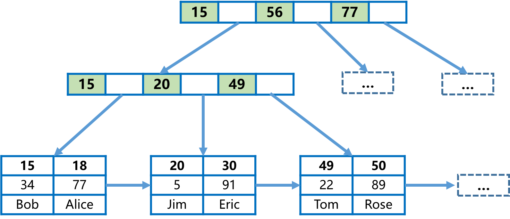

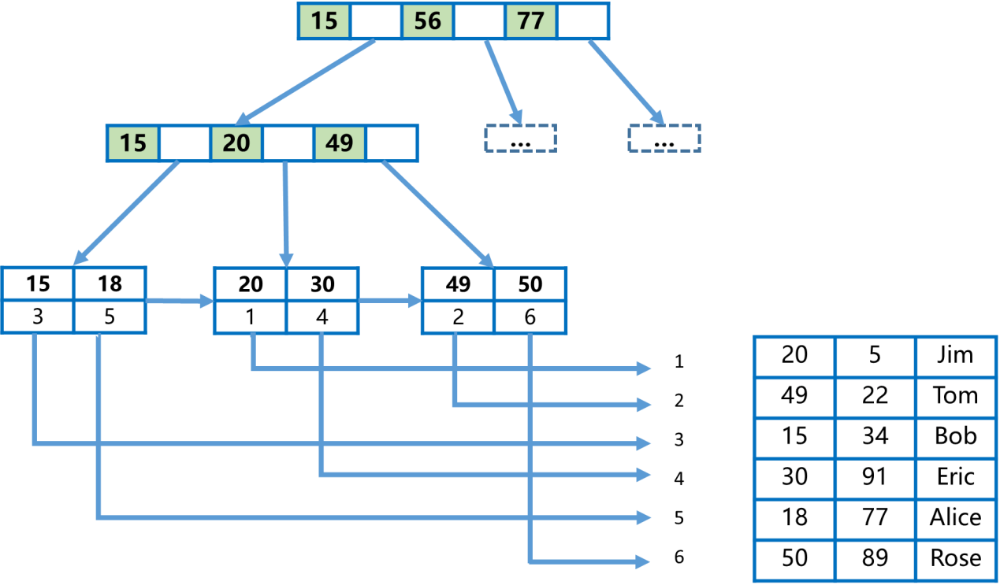

因为时间精力有限，考虑到聚簇索引一张表只能建立一个，而非聚簇索引能建立多个，因此本系统只采用了非聚簇索引，索引节点的Key只能是简单属性值，即只能是int、float、char类型的属性，索引节点的value是记录的tupleOffset，上文已经讨论过，知道tupleOffset之后，就能知道该记录所在的Block和在该Block中的偏移量，也就能读出这条记录了。系统只支持单个属性的唯一索引，当用户没有为主键设置索引的时候，系统会自动为主键设置索引。关于B+树查找、分裂、合并等算法与数据库系统设计关系不大，在这里就不再赘述了。

### 12. 事务管理

事务是一组数据库操作序列，这些操作要么全做，要么全不做，是一个不可分割的工作单位。事务通常是以BEGIN
TRASACTION开始，以COMMIT或ROLLBACK结束。COMMIT表示提交，即提交事务的所有操作。具体地说就是将事务中所有对数据库的更新写回到磁盘上的文件中去，事务正常结束。ROLLBACK表示回滚，即在事务运行的过程中发生了某种故障，事务不能继续执行，系统将事务中对数据库的所有已完成的操作全部撤销，回滚到事务开始时的状态。

本系统实现的事务采用No-Steal策略，即磁盘上不会存在uncommitted数据，也就是事务提交之前，不会有任何数据写入到磁盘中，只有事务提交之后，所有的脏数据才会一次性同步进入磁盘进行持久化保存，回滚也只需要恢复内存的状态即可，无需Undo Log来进行磁盘文件的回滚操作。

本系统实现的事务的隔离级别是Repeated Read，即数据库中的第三级封锁协议。事务T在修改数据R之前必须先对其加互斥锁，直到事务结束才释放；事务T在读取数据R之前必须先对其加共享锁，直到事务结束才释放。此外，本系统的事务基于线程模式，即一个事务对应一个线程，这样就不需要额外去维护事务id来区分各个事务，并且将事务与线程相对应，事务的加锁同步也可以简化到线程的加锁和同步上去，进而借助java提供的API，可以比较容易地实现这个功能。

实现事务需要两种锁：

**互斥锁，又称写锁，X锁**：若事务T对数据对象A加上X锁，则只允许T读取和修改A，其他任何事务都不能再对A加任何类型的锁，直到T释放A上的锁。这就保证了其他事务在T释放A上的锁之前不能再读取和修改A。

**共享锁：又称读锁，S锁**：若事务T对数据对象A加上S锁，则事务T只能读A；其他事务只能再对A加S锁，而不能加X锁，直到T释放A上的S锁。这就保证了其他事务可以读A，但在T释放A上的S锁之前不能对A做任何修改。

从锁的粒度上来说，可以有表级锁，行级锁和块级锁，表级锁会锁住整张表，加锁开销最小但是并发度最低，行级锁只锁相关的记录，并发度最高但是加锁开销最大，块级锁介于两者之间。本系统事务中的锁是块级锁，即以Block为单位。

### 13. 读写锁的实现

为了实现上述功能，我为每一个Block都分配了一把读锁和一把写锁，还有一个线程等待队列。

当一个线程要获取一个Block上的读锁的时候，它需要先检查这个Block上的写锁有没有被获取，如果写锁没有被获取，则可以直接获取读锁；如果写锁被获取了，则再检查这个写锁是不是被当前线程获取了，若果是则可以直接读取数据，无需再次获取读锁，因为写锁的优先级要大于读锁，这个过程叫做锁的降级；如果写锁不是被当前线程获取的，则获取锁失败，系统要将此线程放在该Block的线程等待队列中，等待其他事务提交释放锁之后再重新获取锁。此过程的流程图如下图所示：

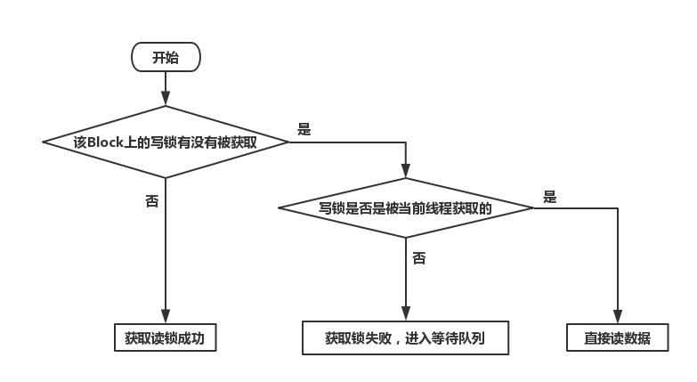

当一个线程要获取一个Block上的写锁的时候，他需要先检查这个Block上的写锁和读锁有没有被获取，如果没有任何锁被获取，则可以直接获取写锁；如果有写锁或者读锁被获取了，则再检查这个写锁或者读锁是不是被当前线程获取了，如果是写锁被当前线程获取了，则可以直接写数据，无需再次获取锁，如果是读锁被当前线程获取了，则要把读锁升级为写锁，这个过程叫做锁的升级；若果读锁或者写锁不是被当前线程获取的，则获取锁失败，系统要将此线程放在该Block的线程等待队列中，等待其他事务提交释放锁之后再重新获取锁。此过程的流程图如下图所示：

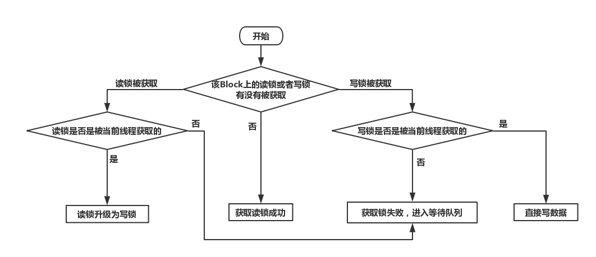

每一个Block都有一个线程等待队列，这个队列是一个双向链表，串接了所有获取锁失败的线程，线程获取锁失败后首先会阻塞自己防止浪费CPU资源，然后按照先进先出的原则进入等待队列。当有一个事务提交或者回滚之后，它会释放获取到的所有的锁，然后系统会检查此事务涉及到的所有的Block的等待队列，从队头开始唤醒线程，重新获取锁，获取成功之后退出等待队列，同时级联唤醒下一个正在等待的线程；再次获取锁失败之后不会退出等待队列，但是仍然会级联唤醒下一个正在等待的线程。下一个等待的线程会重复上述操作，直到唤醒到等待队列的最后一个线程。队列的大致结构如下图所示：

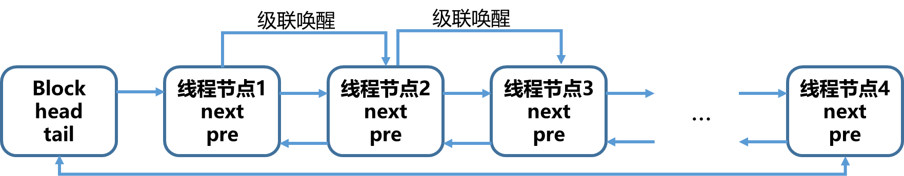

### 14. 死锁的检测与处理

本系统事务锁的粒度是块级锁，由于一个文件包含多个块，所以程序运行过程中可能会出现死锁，即：如果事务T1封锁了数据R1，T2封锁了数据R2，然后T1又请求封锁R2，因T2已封锁了R2，于是T1等待T2释放R2上的锁。接着T2又申请封锁R1，因T1已封锁了R1，T2也只能等待T1释放R1上的锁。这样就出现了T1在等待T2，而T2又在等待T1的局面，T1和T2两个事务永远不能结束，形成死锁。

应对死锁可以采用预防死锁法、避免死锁法、检测与解除死锁法。其中，预防死锁就是破坏死锁产生的必要条件，常见的方式有一次封锁法和顺序封锁法；避免死锁是在资源的动态分配过程中，用某种方法去防止系统进入不安全状态，从而避免发生死锁，常见的算法有银行家算法；检测与解除死锁是指不事先采取任何限制性措施，也不必检查系统是否已经进入不安全区，而是允许系统在运行过程中发生死锁，但是发生死锁之后可以使用某种手段检测出死锁的线程，进而能够解除死锁。

为了方便起见，本系统事务采用了第三种方式，即检测与解除死锁法。系统维护了一个定时任务，每分钟检测一下系统中所有的事务，看看它们是否有死锁的，有的话就把死锁的事务逐个回滚，再次检测死锁是否还存在，如果存在，则继续回滚其他事务，如果不存在了，就说明死锁解除了，此时程序向被回滚事务的线程报告出错，方便程序员做进一步的处理。

检测死锁使用了等待图法，即检测线程开始的时候，先会构建一个图的数据结构，将事务和事务已经获取或者正在等待的Block作为图的点，然后如果一个事务占有一个Block，则有一条边从这个Block指向该事务，如果一个事务正在等待一个Block，则有一条边从这个事务指向这个Block，如下图所示。等这个图建立完毕之后，判断系统中没有没有出现死锁只需要检测一下这个图中有没有环即可了。判断图有没有环的算法有很多，可以进行深度优先遍历，或者拓扑排序等，在这里不再赘述了。

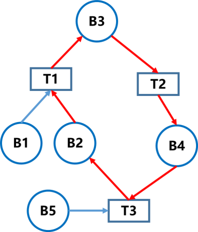

为了能够恢复内存状态，我们还需要在Block中增加setImage和resetImage两个函数，分别代表保存Block快照和恢复Block快照，在一个新的线程获取了Block的写锁的时候需要保存快照，事务回滚的时候需要恢复快照。

### 15. OGNL表达式

上文中提到过，我们把对象存入文件的时候需要遍历对象的属性森林，找到组成对象的所有简单属性，但是我们如何区分这些简单属性是哪个节点的孩子呢？比如前文中的student的例子，student对象自身有个属性name，它内部的复杂属性dept也有个属性叫做name，那么我们如何区分这两个name呢？这就需要OGNL表达式了。

OGNL是Object-Graph Navigation
Language的缩写，它是一种功能强大的表达式语言，通过它简单一致的表达式语法，可以获取对象树中的任意属性，访问方式就是通过使用点号将对象的引用串联起来，例如student对象自身的name属性的OGNL就是name，而student的dept属性的name属性的OGNL是dept.name，同理，dept的id属性可以表示为dept.id，courses的第一个元素可以表示为courses.0，第一个元素的name属性可以表示为courses.0.name等等，因此OGNL的核心就是通过点号来不断地深入对象的内部。

### 16. Object Query Language

关系型数据库之所以应用广泛就是因为有一个统一的结构化的功能强大的语言可以来操作它们，这种语言就是SQL。然而上文也说到了，传统的SQL并不适合我们这个面向对象的数据库，因为它不允许我们使用object，list等复杂类型，因此我们需要自定义一种语言，我把它称为OQL，即Object
Query Language。

OQL的文法跟传统的SQL是差不多的，例如一个Select语句都包含如下几个部分：

>   SELECT (DISTINCT)? selectClause fromClause (whereClause)? (groupByClause)?
>   (orderByClause)? (limitClause)?

>   当然肯定有不同之处，主要有以下几点：

1.  create语句中支持object类型和list类型。其中object和ref语句都表示对象属性，ref表示引用一个已经存在的其他表作为自己的属性，类似于对象的组合，如果一个表被其他表所引用的话，删除这个表的时候，如果不加cascade关键字,即不采用级联删除的方式，程序会拒绝删除，因为当前表被其它表引用了，如果加了cascade关键字，即采用级联删除的话，程序在删除该表的时候，也会把引用它的其他表全部删除掉。下图展示了create语句中可以允许的字段类型，从中也可以看到，创建表属性的文法本身就是递归定义的。

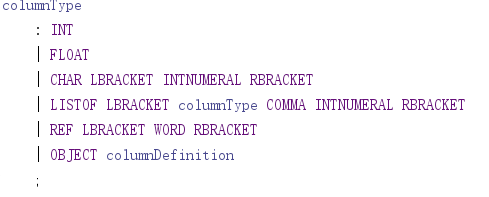

2. create语句支持表属性的继承，属性可以用final关键字来声明。面向对象的两大特性就是继承和封装，因此本系统也支持这两种特性，创建表的时候可以用extend关键字来继承自其它表，这里的继承仅仅是把被继承表中没有被final修饰的属性复制到当前表中，如果有属性不想被子类继承，可以使用final关键字来修饰。同样，如果一个表被其它表继承之后，删除的时候必须添加cascade关键字，如果不添加则系统会拒绝删除，如果添加了，程序在删除该表的时候，也会把继承它的其他表全部删除掉。
3. select语句中必须为表指定别名，方便后续使用OGNL来进行引用，此外，OQL中不支持select * 操作，SQL与OQL的select对照如下：

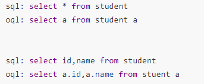

4. 表达式对字段的引用可以使用OGNL来深入到对象内部取值，例如操作student表可以使用如下语句：

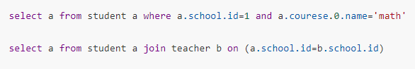

5. insert和update语句都支持对复杂对象进行操作。可以手动拆分对象，也可以不拆分，使用圆括号插入object类型，使用方括号插入list类型，object类型支持使用属性名称来指定字段内容，list类型支持使用序号来指定元素位置，例如操作student表可以使用如下语句：

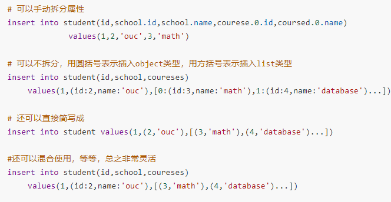

6. OQL支持三种主键生成策略，分别是自动增长AUTO_INCREASEMENT、手动赋值ASSGIN、和随机值UUID，其中随机值UUID要求主键必须是char类型，如果是ASSGIN类型，插入时主键不能为空。

可以看到OQL绝非是改造了SQL，而仅仅是拓展了SQL使其支持面向对象的操作，当然由于本系统是我一个人开发的，不可能把SQL的所有文法都考虑到，例如暂时不支持子查询、视图、授权等等。

### 17. OQL解释器

有了OQL，下一步就是构建一个OQL解释器来完成词法分析、语法分析，把我们输入的字符串变成一棵抽象语法树，方便后续生成执行计划。由于本系统的重点是设计数据库系统，手写解释器对本系统帮助不大，为了节约时间，我直接使用了java语言编写的，比较成熟的解释器自动生成工具ANTLR，它能将我们定义的文法自动进行词法分析和语法分析，最终构建成一棵抽象语法树，如下图所示：

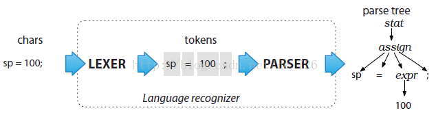

ANTLR生成的解析器叫做递归下降解析器（recursive-descent parser），属于自顶向下解析器（top-down
parser）的一种。递归下降分析法的原理是利用函数之间的递归调用来模拟语法树自上而下的构建过程，从根节点出发，自顶向下为输入串中寻找一个最左匹配序列，建立一棵语法树。ANTLR建立抽象语法树的时候充分利用了面向对象的程序设计思想，通过对象的组合和继承，构成了一整棵抽象语法树。例如，select语句中有非终结符selectClause，formClause，whereClause，orderClause等等，这些非终结符都以组合的形式出现作为select节点的孩子，而再比如insert语句中，插入的内容可以是数字类型、字符串类型、对象类型、列表类型等等，这些都是插入值（NewValueContext）的子类。下图给出了ANLTER生成的语法树中的两处继承关系：

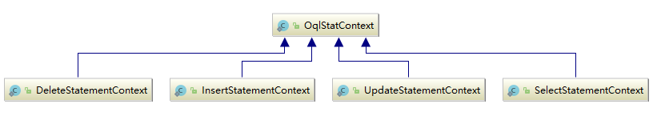


### 18. 逻辑执行计划

得到抽象语法树之后，我们首先需要遍历抽象语法树进行语义分析，检查一下操作的表是否存在，属性值是否存在，属性和值类型是否一致，数量是否匹配等等，即保证输入的OQL是正确的，安全的，可以产生正确的执行计划得到正确的操作结果。

检查没有错误之后，就可以构建查询的逻辑执行计划了，逻辑执行计划就是由关系代数组成的表达式树，下面两张图片展示了OQL：

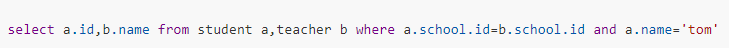

生成的抽象语法树和它转化而成的关系代数表达式，即逻辑执行计划。


仅仅得到这么一个逻辑执行计划还不够，为了能够将这个逻辑执行计划转化为一个比较高效的物理执行计划，进而提高查询的速度，我们需要对这棵关系代数表达式进行优化，即代数优化。代数优化是指关系代数表达式的优化，即按照一定的规则，通过对关系代数表达式进行等价变换，改变代数表达式中操作的次序和组合，使查询执行更加高效。

代数优化分为基于公式的优化和基于启发式规则的优化，基于公式的优化比较准确，优化效果较好，但是实现困难，考虑的情况比较复杂；基于启发式规则的优化得出的结果有时候可能不是最优的，但是与最优解相差不大，并且实现起来比较容易。因此，本系统使用启发式规则来对逻辑执行计划进行优化，具体来说，有以下规则：

1.  选择操作尽可能深地推入表达式树中。如果一个选择条件是多个条件的AND，则我们可以把该条件分解并分别将每个条件下推。

2.  类似地，投影操作也应该尽可能深地推入表达式树中。

3.  把某些选择同在它前面要执行的笛卡尔积结合起来成为一个连接运算，连接运算要比同样关系上的笛卡尔积省很多时间。

4.  把投影操作和其前或后的双目运算符结合起来或者选择和投影一起做，防止重复扫描。

根据以上原则，优化的的关系代数表达式如下图所示：


### 19. Split-Merge Algorithm

为了能实现上述启发式优化过程，我提出了一种简单易懂的算法，它通过分割逻辑表达式树，然后将表逐个连接，是一个先拆分后合并的过程，我原本想叫它Map-Reduce算法，不过现在这个名字已经被广泛采用了，为了不引起误会，我把我提出的这个算法称为Split-Merge算法。

我们首先来说一下逻辑表达式树，每一个select语句的Where条件部分都会构成一棵逻辑表达式树。Where条件是由一个个原子条件通过逻辑谓词AND、OR、NOT连接起来的，这些逻辑谓词中，NOT的优先级最高，AND次之，OR的优先级最低。为了能准确得出这一串表达式的值，我们必须构建一棵树形结构，优先级越高越靠近叶节点，优先级越低越靠近根节点，我们要求一个where表达式的值得时候，只需要后序遍历where表达式构成的逻辑表达式树，自下而上逐个求值即可。例如如下的where条件的树形表示如下图所示：


在Where表达式树中，AND谓词连接的两个条件是可以拆分的，因为AND表示与操作，即两边都要满足，一次性全满足和分开逐个满足效果是相同的，比如要选择a.id=1 AND a.name=’tom’的记录，可以一次性遍历选出同时满足两个条件的，也可以遍历两次，先选出a.id=1记录，再选出a.name=’tom’的记录，效果是一样的。但是OR条件就不一样了，OR条件表示或，两边满足一个就可以，只能通过一次遍历选出，不能拆分。

为了将选择条件进行下推，我们是需要对这棵逻辑表达式树进行拆分的，例如，我们可以将上述的逻辑表达式树拆分成如4个模块，如下图所示。拆分的方法可以采用深度优先搜索法，自上而下，遇到AND节点就继续遍历左子树，遍历右子树；遇到OR就表示不能拆分了，应该向上return。

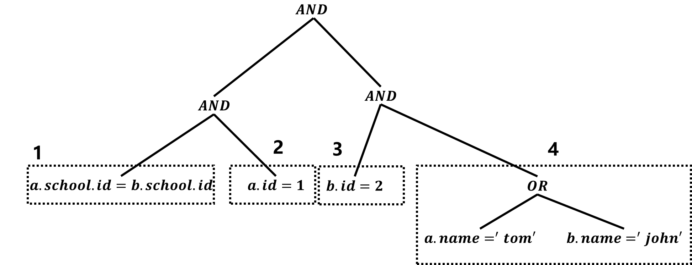

为了方便进行统一处理，我们可以将自然连接转化为带条件的笛卡尔积，即如果有自然连接：a join b
on(a.id=b.id)，我们不单独处理自然连接，而是将这个自然连接当做带条件的笛卡尔积，即select \* from a,b where a.id=b.id，a和b当成笛卡尔积，on后面的条件以AND的形式附加到where表达式树中，下文可以证明，这种统一化是正确的，并且不会影响性能，而且方便我们进行统一处理。

有了上面的基础，我们就可以说一下Split-Merge算法的大体流程了，假设我们要处理如下的select语句：

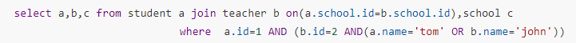

大致流程为：

1.  将自然连接转化为带条件的笛卡尔积，转化后的OQL如下：

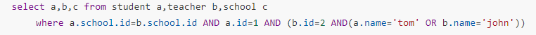

2. 由where表达式构建逻辑表达式树，如上图所示。

3. 拆分逻辑表达式树，用一个Map将拆分得到的所有子表达式树存储起来。其中，Map的key就是这几个表达式树，Map的value是个列表，代表这个子表达式树涉及的表，在本例中，子表达式树1涉及到的表有a和b，而子表达式树2涉及的表只有a，子表达式树3涉及到的表只有b，子表达式4涉及到的表有a和b，Map结构如下图1所示，此时我们我的逻辑执行计划如下图2所示。

   图1：

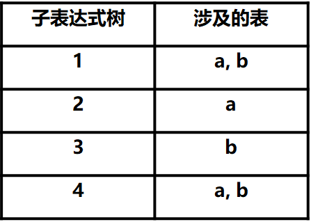


​	图2：


4. 第一次遍历这个Map，找到Map中只涉及一个表的子表达式树，例如上文中的2和3，证明这个子表达式树不需要进行连接运算，也就是说可以进行选择条件的下推，找到之后，直接下推到相应表的上面，并将这个子表达式树在Map中删除。上面例子中，处理完后，Map的结构如下图1所示，此时我们的逻辑执行计划如下图2所示。

   图1：

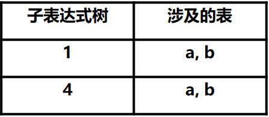

​	图2


5. 构建一个二维数组List，用来做连接运算。二维数组的行数代表还有几组表没有连接在一起，初始情况下就是所有待连接的表的数量，表示所有表都没有被连接在一起，最终的结果一定是这个第一维变成1，表示所有的表都连接在一起了，二维数据的第二维每一列表示哪些表已经连接在一起了，初始情况下就是每张表自身，最终结果一定是所有要连接的表，代表所有的表都已经连接在一起了。在本例中，List的初始结构和最终结果如下图所示。

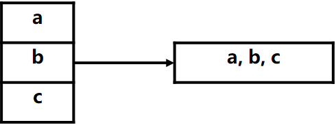

6. 第二次遍历Map，得到每一个逻辑子表达式树涉及的表，然后在List中查询每一个表，看看这个逻辑子表达式树涉及的表分布在List的几个行中，如果涉及的表全部在一行中，证明涉及的表已经全部连接在一起了，我们只需要将这个条件添加到这些连接好的表上面就行了，这也算是选择条件的下推；如果涉及的表不在一行中，证明这些表没有连接在一起，我们需要将这两行合并，表示将这两部分的表连接在一起了。在本例中，处理子树1的时候，涉及的表a，b在不同行中，我们需要连接他们合并表格，合并后的List如下图1所示，此时的逻辑执行计划如下图2所示。处理子树4的时候，涉及的表a，b已经在同一行中了，证明a，b已经连接在一起，我们只需要把这个where条件添加上去即可，此时我们我的逻辑执行计划如下图3所示。

   图1：

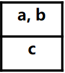


​	图2


​	图3：


7. Map处理完后，证明所有的选择条件都处理完了，再看看List现在的行数是否是1，如果是1证明所有的表都已经连接在一起了，算法结束。如果不是1，证明有没有条件的笛卡尔积运算，我们这需要逐个连接这些组即可。在本例中，行数不为1，因为我们还有表c没有连接上，把c和ab连接起来即可，如图1所示，最终得到的逻辑执行计划如下图2所示。

   图1：


​	图2：


综上所述，Split-Merge多表连接算法实质上就是从下到上，由分散到聚集连接各个表，尽可能地下推各个选择条件，进而构建逻辑执行计划。从上述算法也可以看到我们一开始把自然连接当做带条件的笛卡尔积，到后面又把这个带条件的笛卡尔积恢复成自然连接了，因此不会有性能上的损失，并且还能让我们进行统一的处理。实践证明，Split-Merge多表连接算法是相对来说比较高效的，并且容易实现，也容易理解。

### 20. 物理执行计划

逻辑执行计划必须转为物理执行计划，物理执行计划不仅指明了要执行的操作，而且也找出了这些操作的执行顺序、执行每步所需的算法、获得所存储数据的方式以及数据从一个操作传递给另一个操作的方式。

比如，底层的扫描操作可以有顺序扫描Sequence-Scan和索引扫描Index-Scan，两个表进行连接的操作可以有Nested-Loop-Join、Sort-Merge-Join、Index-Join、Hash-Join，数据的传递方式可以有流水线方式和物化方式等，多表连接可以采用左深树的连接方式、右深树的连接方式和浓密树的连接方式，连接的顺序也可以变等等。

所以一个逻辑执行计划很可能对应多个物理执行计划，下图展示了上述逻辑执行计划对应的一种可能的物理执行计划。如何从这众多的物理执行计划中选出一个最优的，这便是物理优化要完成的工作，常见的方式有枚举法、动态规划法和启发式选择法。


枚举法就是从上到下或者从下到上，枚举逻辑执行计划可能对应的每一个物理执行计划，然后对得到的物理执行计划进行代价估算，进而选择一个执行代价最小的物理执行计划。

动态规划法是对枚举法的一个改进，枚举法的搜索空间非常巨大，在短时间内难以完成。动态规划法是对自下而上枚举的一个改进，即对于逻辑查询树的每个子表达式，我们仅仅保留最小代价的物理计划。当我们自底向上对逻辑查询树处理时，我们假定每个子表达式都使用了最佳的物理执行计划，从而得到全局的物理执行计划，因此动态规划法选出的物理执行计划可能不是最优的，但是速度要比枚举法快很多，因为它不需要回溯的过程。

以上两种方式都需要估算运算的代价，估算代价的过程是非常复杂的，需要构建表的统计直方图，处理连接顺序的时候还要构建左深树，基于动态规划或者贪心算法去选择一个最佳的连接顺序。由于本系统是我一个人完成的，时间精力有限，暂时就没有完成以上两种方法，仅仅是采用了比较容易实现，并且效果还不错的启发式选择法。启发式规则是人们根据经验总结出来的一些规则，实践证明，遵循这些规则往往能够取得很好的优化效果，比如，对于连接操作来说，启发式规则有：

1.  如果两个表都已经按照连接属性排序，则选用Sort-Merge-Join算法。
2.  如果一个表在连接属性上有索引，则可以选择Index-Join算法。
3.  如果上面两个规则都不适用，其中一个表较小，则可以选用Hash-Join算法。
4.  最后可以选择Nested-Loop-Join算法，并选择其中较小的表作为外循环的表。

### 21. 基于流水线的迭代器算法

得到物理执行计划树之后，我们需要自下而上地执行所有的物理计划，执行方式的有两种，流水线和物化。

执行一个查询计划最原始的方式是对运算进行适当的排序，直到位于一个运算下面的子运算已经全部被执行完成，并且将每个运算的结果存储在磁盘上直到它被另一个运算所需要，这个策略叫做物化，因为每个中间关系在磁盘上被物化。

执行一个查询计划的一个更巧妙、更有效的方法是一次同时交错进行几个运算。由一个运算产生的元组直接传递给使用它的运算，不需要将中间元组存储在磁盘上，这个方法叫做流水线操作。流水线的优点是非常明显的，极大地减少了磁盘IO，但是流水线也有缺点，由于任何时候几个运算必须共享内存，当中间结果非常大，比如排序、聚集运算等等，可能会发生内存溢出。但是考虑到现代计算机的内存大小都比较可观了，并且本系统的数据量不会很大，因此我采用了流水线操作来执行物理计划。

流水线操作可以使用迭代器实现，迭代器是四个方法的集合，这四个方法允许物理操作符结果的使用者一次一个元组地得到这个结果，这三个方法是：

1.  open()。这个方法启动获得元组的过程，但并不获得元组。它初始化操作所需的所有数据结构，并且会迭代调用每个子操作对象的open()方法。

2.  getNext()。这个方法返回结果中的下一个元组，并且对数据结构做必要的调整以得到后续元组。在获取结果的下一个元组时，它通常在操作对象上一次或者更多次地调用getNext()方法。如果再也没有元组返回了，getNext()方法将返回特殊值NotFound，这个值肯定不会与任何元组混淆。

3.  hashNext()。这个方法返回操作对象是否还能获取到下一个元组，如果能获取到，返回true，代表上面的getNext()方法能返回一个元组，如果不能，返回false，代表上面的getNext()方法会返回特殊值NotFound，此方法通常被一个操作的上级操作调用来判断是否能取到一个元组。

4.  close()。这个方法在所有元组或使用者想得到的所有元组都获得后终结迭代，它通常会迭代每个子操作对象的close()方法。

我们可以通过迭代器来执行流水操作，每次需要一个元组的时候，流水线操作结果的消费者就调用getNext()方法，例如选择操作Filter的流程如下图所示：


为了实现上述操作，我定义了一个接口DbIterator，里面定义了这三个方法，所有的操作都需要实现这个接口，又因为除了最底层的扫描操作，即顺序扫描SeqScan和索引扫描IndexScan的Open、Close和getNext方法需要操作具体的块之外，其他的上级操作，比如选择操作Filter，投影操作Project，连接操作Join等等，都是建立在SeqScan或者IndexScan之上的，它们不需要操作具体的Block或者文件，而只是调用子操作的getNext方法获取元组，并做进一步处理，因此为了简化代码，我又定义了一个实现了DbIterator的接口的抽象类Operator，实现了除了getNext之外的其它方法，这个体系的UML类图如下图所示：

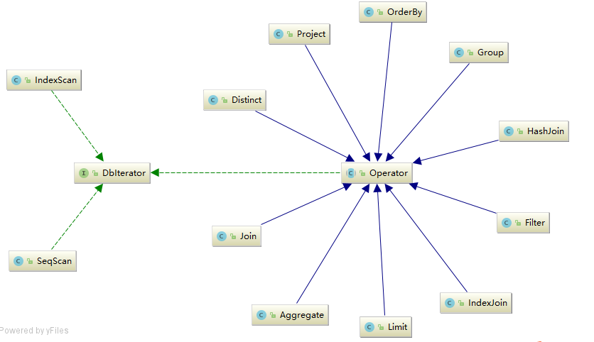

这样我们就可以把所有的操作都当成无差别的DbIterator来对待了，借助多态来完成不同的操作，例如最简单的SeqScan操作的大体代码如下：

```java
@Override
public void open() {
    open = true;
    tupleScan = 0;
    tupleOffset = 0;
}

@Override
public boolean hasNext() {
    if (!open) throw new DbException("the iterator has not opened");
    return tupleScan < tupleNum;
}

@Override
public Tuple getNext() {
    if (!open) throw new DbException("the iterator has not opened");
    while (hasNext()) {
        Block block = Record.getBlock(tableName, tupleOffset, READ);
        int isAvailable = block.readInt();
        int dataOffset = block.getDataOffset();
        if (isAvailable == TUPLE_AVAILABLE) {
            Tuple tuple = Record.readTuple(block, tableName, tableAlias);
            tupleScan++;
            tupleOffset++;
            block.setDataOffset(dataOffset + tupleLength);
            return tuple;
        }
        tupleOffset++;
        block.setDataOffset(dataOffset + tupleLength);
    }
    return null;
}
@Override
public void close() {
    open = false;
}
```


而上级操作Filter的大部分操作都已经被Operator抽象类实现了，它只需要提供一个getNext()方法就可以了，另外，它需要嵌入一个提供元组的子操作，大体代码如下：

```java
private DbIterator child;

private WhereNode whereTre;

protected Tuple fetchNext() {
    while (child.hasNext()) {
        Tuple next = child.next();
        boolean filter = JudgeUtil.whereJudge(next, whereTre);
        if (filter) return next;
    }
    return null;
}
```


当然这么做也有缺点，比如排序order，或者去重distinct等操作需要在open函数中就把子操作的所有元组都读入内存才能排序或者去重，当数据量比较大的时候，会发生内存溢出，但是上文中也提到过了，现在计算机的内存大小都比较可观了，并且时间精力有限，我们暂时假设执行排序、去重的数据量不会超过内存的大小，那采用这种流水线的方式就可以比较流畅地执行物理计划了。

### 22. 服务端与客户端通信

一切流程都能跑通了，我们就能输入一个OQL，得到一个输入结果了。下面的工作就是建立一个服务器，能够接受客户端发送来的OQL，并能把结果返回给客户端。

建立服务器有BIO和NIO两种方式，其中BIO要为每个连接维护一个线程，如果这个连接中客户端没有消息要发，这个线程会阻塞，会浪费服务器内存资源，如果连接数过多的话，服务器可能会因为线程数过多而发生内存溢出。NIO基于selector和通道，通道注册到selector上，可以实现一个线程监听多个连接，如果当前连接没有消息要发的时候，服务器线程可以转而去处理其他连接的请求，可以节约资源。

由于本系统的事务是基于线程实现的，因此必须要为每一个连接单独维护一个线程，也就必须采用BIO的方式，这是本系统存在的一个不足之处，未来可能会改变事务的实现方式从而能使服务器支持NIO的连接方式，提高服务器能容纳的连接数。

因为有了OQL，所以我们不用再去额外定制客户端与服务端的通信协议了，客户端只需要发送OQL，服务器接收OQL，进行合法性安全性检查、词法分析、语法分析、语义检查、生成执行计划并执行，最终得到执行结果，然后将执行结果序列化成二进制流，传送给客户端即可，流程图如下图所示：


为了能以列表的形式直观地打印出查询结果，本系统开发了类似于Mysql控制台那样的表格打印系统，由于本系统的字段支持复杂类型和列表类型，因此表格也是嵌套的，即有表中套表的情况出现。打印的方式就是先深度优先遍历属性森林，找到嵌套表的最大深度和表项的宽度，然后再广度优先遍历属性森林按层打印属性森林即可，效果如下图所示：

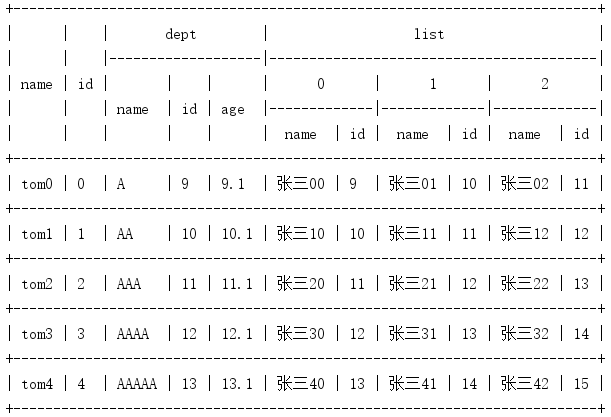

服务器和客户端都有一些可配置的属性，方便系统进行弹性调整，例如对于服务器来说端口、数据库文件所在的目录、客户端最大连接数、块的大小和数量、同步任务执行时间都是可以配置的，用户可以把这些配置写在config.xml文件中，服务器启动会读取这个配置文件，如下图所示，用户没有显示配置的信息则使用默认值；对于客户端来说，连接服务器的域名和端口是可以配置的，用户可以把这些信息写在beauty.xml中，如下图所示，用户没有显示配置的信息则使用默认值。

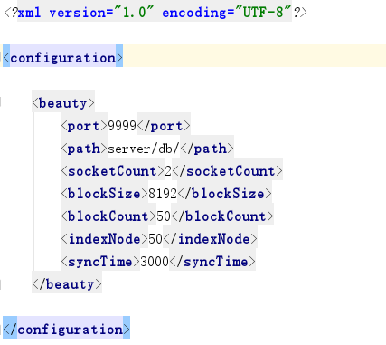

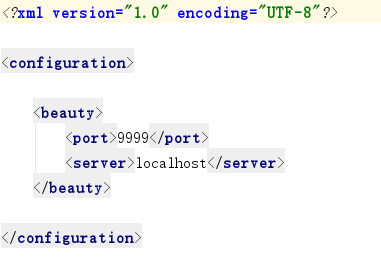

服务器端还会维护一个定时任务，用于将内存中被修改过的Block中的内容写入文件。因为在本系统中，不管是读还是写，直接操作对象都是Block，而不是文件，只有在一个Block被替换出去或者程序正常结束的时候，Block中的脏数据才会写入文件，因此如果程序发生了宕机或者遇到了断电等非正常的关闭，内存中的数据就会丢失，由于本系统没有日志系统，所以数据一旦丢失便找不回来了。为了尽量避免数据的丢失，本系统设计了这么一个数据定时刷新系统，定时将内存中携带脏数据的并且没有被任何事务锁定的Block中的内容刷新入文件中，定时任务的执行间隔也是可以配置的，时间间隔越短，数据丢失的可能性就越小，但是对系统性能的影响就越大；时间间隔越长，对系统性能的影响就
越小，但是数据丢失的可能性就越高。

### 23. Session与SessionFactory

API调用的第一步肯定也是要拿到一个与客户端的连接，这个连接就是session，所以不管采用哪种API调用方式，第一件事情就是要拿到一个session，任何API调用最终都会转换成session上的两个方法，即sendMessage()和getResonse()，前者用于发送OQL，后者用于从服务器获取响应数据。

session可以由工厂sessionFactory的getSession()方法生产，sessionFactory是全局单例的，也就是说一个应用中只会存在一个sessionFactory对象，sessionFactory对象有两个属性，server和port，表示要连接的服务器的域名和端口号。sessionFactory对象可以通过读取xml配置的形式生成，即sessionFactory上的getFactoryByXml()方法，xml如下图所示，xml中没有配置的内容会使用默认值。

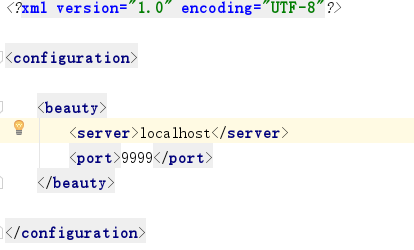

上文中也说到了，本系统的API调用层可以与Spring无缝集成，所以sessionFactory也可以通过Spring来进行配置，使用的时候直接使用@Autowired注解自动注入即可，如下图所示：

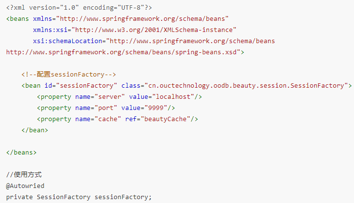

### 24. 连接池管理

与客户端建立和断开连接都是非常耗时的，因为服务器要为每一个连接创建一个线程，线程的创建和销毁是耗时的，重新建立TCP连接也是耗时的，所以加起来更加耗时。为了降低资源消耗，提高相应速度和提高连接的可管理性，本系统设置了session连接池，即系统启动时就会创建几个与服务器的连接，放入连接池中，等用户调用sessionFactory.getSession()的时候，系统不是去创建一个连接，而是直接从连接池中拿过来一个连接直接用就行了，调用sessionFactory.closeSession()的时候，也不是去断开连接，而是将连接归还给连接池方便下次使用，这样就能降低资源消耗，提高相应速度。

连接池有几个参数，分别是初始连接数initSize，代表系统启动时会创建多少连接放入连接池中；最大连接数maxSize，当系统没有空闲的连接时，用后还再要连接，这时系统会创建新的连接放入连接池中，直到连接总数到达maxSize，到达maxSize证明不能再继续创建连接了，此时如果再有线程要获取连接的话，该线程会阻塞，直到有其他线程释放连接；最大空闲时间idleTime，如果连接池中空闲的连接数大于initSize，则系统会在空闲时间超过idleTime后将多于initSize的连接断开以节约资源。

这些参数可以通过xml进行配置，进而通过SessionPool上的getPoolByXml()方法进行获取，如下图所示，也可以通过spring进行配置，如下图所示：

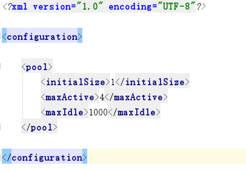

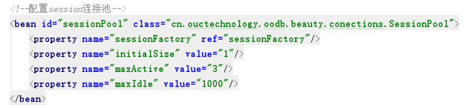

注意，如果使用SessionPool上的getPoolByXml()方法获取的连接池，就不能再用sessionFactory.getSession()方法去获取session了，这样还是不带连接池的，必须通过sessionPool.getSession()方法来获取session。而通过Spring配置的方式则不用，因为系统检测到配置了SessionPool后，会用装饰模式去装饰原来的SessionFactory使其带有连接池的效果，所以使用Spring只需要在xml去配置SessionPool即可，使用还是使用SessionFactory，此时的SessionFactory已经被装饰过了，getSession()方法和closeSession()方法均是操作连接池。

### 25. 两级缓存系统

数据访问也同样遵循二八定律，即80%的请求集中在20%的数据中，因此增设一个缓存系统非常重要，程序发出一个查询OQL后，先去缓存中找，如果缓存中存在就可以直接返回，不用再发网络请求了；如果缓存中不存在，则需要发送网络请求去服务器请求数据，服务器返回数据后先放入缓存中，再返回给调用者。

本系统设计的是一个两级缓存系统，其中一级缓存位于session对象中，默认开启，替换算法为LRU，会缓存DQL语句查询结果，DDL语句会刷新相关对象的缓存，缓存生命周期与session相同；二级缓存位于SessionFactory对象中，默认关闭，可以配置多种替换算法(FIFO、LRU、LFU)，缓存可以跨session而存在，可以使用\@NoCache或者\@NoFlush注解来指定方法不使用或者不刷新缓存。配置两级缓存系统的原因是一级缓存更为直接，可以较多地缓存当前session的查询结果，但是一级缓存不能跨session而存在，如果新开了一个session，那么它是无法使用其他session上的缓存的；而二级缓存在SessionFactory中，是可以跨session的，因此一个session的查询结果可以被其他session所使用，但是二级缓存的容量有限，缓存不了那么多东西，所以只有一级缓存和二级缓存同时工作时，才能取得最佳的缓存效果，两级缓存系统的工作图如下图所示：


二级缓存可以通过BeautyCache类上的静态方法getCache()创建，创建需要指明二级缓存的大小和替换策略，替换策略有三种，即FIFO、LRU、LFU，也可以通过Spring的配置方式，如下图所示，配置完成之后，set进入SessionFactory就可以使用了。

如果有DQL结果我们不希望被缓存，那么可以使用@NoCache注解或者带参数的查询来告知缓存系统不缓存查询结果，比如要查询的是一个经常变动的List，缓存的意义就不大，因为对此List中任何记录的增删改都会使缓存失效。如果有一个DDL我们不希望它刷新缓存，那么可以使用\@NoFlush注解或者带参数的更新来告知缓存系统不刷新相关缓存，比如insert操作，如果不把insert的刷新缓存关掉，那么我查询一个id=1的记录被缓存了，又插入了一个id=2的记录，此时系统检测到是操作的同一张表，会刷新缓存，那么id=1的那条记录也没了，这是我们不希望看到的结果，因此可以把insert的刷新缓存效果关掉。


### 26. 原生OQL查询与Query对象

session上有丰富的API提供了各种各样的查询方式，其中最直接的就是使用原生的session.createOql(String
oql)查询方式，此函数直接把传入的OQL发送给服务器，并返回服务器传回的结果，对结果不进行任何封装直接返回。

我们希望系统能将查询的结果自动封装成列表、相应的对象或者整型数字，这时候就需要Query对象了，可以通过session.createQuery()创建一个Query对象，Query对象提供的API及用法如下：


### 27. Query By Example

既然是面向对象的数据库系统，那我们也要支持面向对象的查询方式，也就是说我们的查询应该摆脱手写OQL的方式，用对象发出查询，把OQL的拼接工作交给系统完成，这样写起代码来才更加方便、优美，效率才会更高。本系统提供了大量的面向对象的查询方式，下面我将逐一介绍。

首先是Query By Example，即QBE。即通过一个具体的对象，反射对象的属性，拼接类似于where XX=XX AND
...的OQL，例如下面的查询：


生成的OQL为：


QBE虽然方便，但是也有明显的限制，比如：系统必须反射模板（example）对象的所有成员；无法执行更进一步的查询表达式（例如 AND、OR、NOT 等等）；不能约束 0（整型）、””（空字符串）或者 null（对象），因为这些都被认为是不受约束的。

### 28. Native Queries

Native Queries 即NQ，它是通过一个带有泛型的查询接口Predicate，查询通过调用Predicate接口上面的match方法来进行匹配，用户可以自定义Predicate接口的实现类来实现不同的查询条件，比如上面的QBE用NQ改写，是这种样子：


NQ使得我们的查询代码是100%的类型安全、100%的编译时检查以及100%的可重构，解决了QBE存在的大部分问题，但是NQ还是有局限性，比如不能实现投影、聚集、多表连接等功能。

### 29. Criteria面向对象查询

为了解决QBE和NQ的不足，本系统模仿Hibernate，设计并开发了一套面向对象的、功能强大的、可拓展的查询方式Criteria。Criteria使用非常灵活，功能非常强大，可以实现选择、投影、连接、聚集等OQL可以表示的所有查询方式。

Criteria有三个组成部分，分别是准则Criterion、投影Projection、连接JoinCondition，他们都是接口，它们的各个实现类对应了选择、投影、连接、聚集等不同的操作，相关的UML类图如下图所示：


对于这三种组成部分来说，都有相应的工厂类来生产不同的条件，如下图所示：


下面来详细讲一下Criteria的用法：

1.  创建一个 Criteria 实例，Session 是 Criteria 实例的工厂。


2. 限制结果集内容，一个单独的查询条件是Criterion 接口的一个实例。Restrictions类定义了获得某些内置 Criterion 类型的工厂方法。


​	约束可以按照逻辑进行分组


3. 结果集排序和限制结果集数量


4. 投影、聚合和分组


​	可以选择多个条件


​	聚集函数


5. 连接


### 30. 全注解式查询

与Mybatis相似，本系统在实际的应用中可以有两种使用方式：一种是用本系统提供的查询方式手动实现数据库访问层DAL(Database Access Layer)，另一种是直接使用本系统当做DAL，这就是全注解式查询。

本系统为全注解式查询提供了九个注解，他们的名词及作用如下：

| @Beauty | 放在接口上，表示这是一个要实现的DAL，程序启动的时候会扫描所有贴有\@Beauty注解的接口，并使用JDK动态代理进行包装 |
| ------- | ------------------------------------------------------------ |
| @Select | 放于方法之上，表示此方法为查询操作，需要填入要执行的OQL作为参数 |
| @Insert | 放于方法之上，表示此方法为插入操作，需要填入要执行的OQL作为参数 |
| @Update | 放于方法之上，表示此方法为更新操作，需要填入要执行的OQL作为参数 |
| @Delete | 放于方法之上，表示此方法为删除操作，需要填入要执行的OQL作为参数 |
| @Id     | 放于字段之上，表示主键，需要填入参数作为主键生成策略，如果不填，默认为ASSIGN |
| @Length | 放于字符串字段之上，表示字符串的长度，缺省长度为255          |
| @Size   | 放于列表字段之上，表示列表的容量，此注解为必填项             |
| @Param  | 放于方法参数之上，指明参数的名称，用于带参数的OQL，需要填入参数指明这个参数的名称 |

使用注解式建表时，需要先写一个实体类domain，然后调用session.create()方法，实体类如下：


调用方式：


使用注解式作为应用的DAL时，我们首先需要建一个接口，然后贴上@Beauty注解，然后定义接口的方法，方法之上贴上相应的@Select、@Update、@Delete、@Insert注解，注解的参数需要使用带参数的OQL，如下图所示：


带参数的OQL就是把需要填入具体值的位置使用\#{OGNL}的形式进行替换，花括号里面的参数首先会作为OGNL去方法参数对象中去寻找值，如上图所示。如果找不到或者对象内的属性不合适，则可以使用@Param注解指明方法的参数，然后把它填入\#{}之中，如下图所示：


如果还是找不到，系统会尝试直接使用参数本身作为值填入OQL中，例如下面只有1个int参数的方法，\#{}里面的东西可以随便写：


Select方法的返回值可以有List类型，对应多条查询结果，可以是对象类型，对应单条查询结果，也可以是Int类型，代表count，max等聚集操作。

Update、Delete、Insert语句可以有返回值，可以没有返回值，有返回值必须是int类型的，代表方法执行后受影响的行数。

写完这个接口后，我们的DAL就写完了，我们不要写任何这个接口的实现类，我们使用的时候，系统会自动为它创建实现类。

我们使用的方式有两种，第一种方式是通过session上的getBeauty()方法，例如：


调用这个方法后，系统会使用JDK动态代理对这个接口进行包装，创建这个接口的实现类，来调用OQL，实现相应的功能。

第二种方式是与Spring集成，需要配置一个注解扫描器，用来扫描所有贴有\@Beauty注解的接口，这个注解扫描器中需要指定扫描的包即basePackage，和用于获取session的SessionFactory：


配置完成之后，应用启动的时候，程序会自动扫描basePackage下所有贴有\@Beauty注解的接口，使用JDK动态代理对接口进行包装，创建接口的实现类，放入Spring容器中，然后我们使用的时候只需要从容器中去拿生成好的代理类即可：


### 31. 继承BaseBeauty接口

虽然全注解式开发已经能大大减少我们DAL的代码了，因为我们仅仅需要定义接口，定义方法就就可以了，不需要为接口编写实现类，不需要实现方法。但是像下面这些基本的增删改查的方法：


几乎是所有DAL共有的方法，也就是说我们新建一个DAL，第一件事情就是来写这几个增删改查的方法，这样还是会造成代码重复，因此我们可以把这些方法抽出来，写成一个带有泛型的接口BaseBeauty\<T\>，然后我们每建一个DAL，就让它继承自我们的这个BaseBeauty接口，这样这个DAL就能自动拥有这5个方法了，就不需要我们再自己定义了，可以进一步减少代码量。

### 32. Query By Property

在实际应用中，我们经常会遇到根据属性查找或者更新删除的操作，比如根据主键获取一条记录，或者更新删除一条记录，我们通常需要写findById()，updateById()，deleteById()等方法，这个id就是属性，登录的时候要根据用户名和密码去查询用户，就需要写一个findByNameAndPassword()方，这里的name和password也是属性。

这种根据类属性查找或者更新删除的操作是非常常见的，但是我们现在需要这些方法的时候，还是要自己去写OQL，像下面这样：


但是这些操作的模式都是固定的，即以findBy或者updateBy或者deleteBy开头，后面是属性通过AND和OR连接起来的，一个对象的属性我们是可以用反射获取到的，所以我们可以在对这个\@Beauty接口使用JDK动态代理进行包装的时候，自动为这个方法生成OQL，就不用我们自己写了，这就是QBP(Query
By Property)，此种查询方式借鉴了Spring Data JPA。

QBP的相关语法规定如下：

| **关键词**       | **Demo**                               | **OQL语句片段**                            |
| ---------------- | -------------------------------------- | ------------------------------------------ |
| And              | findByLastnameAndFirstname             | where x.lastname = ?1 and x.firstname = ?2 |
| Or               | findByLastnameOrFirstname              | where x.lastname = ?1 or x.firstname = ?2  |
| Equals           | findByFirstname, findByFirstnameEquals | where x.firstname = ?1                     |
| LessThan         | findByAgeLessThan                      | where x.age \< ?1                          |
| LessThanEqual    | findByAgeLessThanEqual                 | where x.age ⇐ ?1                           |
| GreaterThan      | findByAgeGreaterThan                   | where x.age \> ?1                          |
| GreaterThanEqual | findByAgeGreaterThanEqual              | where x.age \>= ?1                         |

有了QBP之后，我们的方法就可以直接简化成下面这样了，也就是说不需要我们自己去写OQL了。


有了全注解式开发，继承BaseBeauty接口，QBP等，我们的DAL层可以说是非常简洁了，甚至很多情况下不需要我们编写任何一行代码就能实现增删改查，用起来非常迅速，可以使程序员有更多的精力投入到业务逻辑的开发中去，能大大提高开发效率。

### 33. 本系统的贡献

1. 本系统自下而上为对象的持久化提供了一整套的解决方案，下到OQL解析、执行计划生成、文件存储、索引建立、事务管理，上到丰富的API调用、连接池、两级缓存、与Spring无缝集成等，旨在让数据库的操作尽可能地简单，让程序的持久层DAL(Database Access Layer)代码尽可能得少，从而使程序员能将更多的精力放在业务逻辑代码中，进而能大大提高开发效率。
2. 相比于传统的RDBMS，本系统扩充了字段的数据类型，使其能够支持object对象类型和List列表类型，也就是说允许表中套表。但是本系统绝不是否认了数据库设计第一范式，而是将这一范式运用地更加灵活了，将对象的拆分合并工作都交给了数据库引擎。
3. 本系统创造性地提出了对象属性森林的概念，通过对属性森林的深度优先遍历，可以找出组成对象的所有简单属性，可以把任何复杂类型都当做简单类型的集合来处理。
4. 相比于传统的ORM框架Hibernate、Mybatis等，本系统的ORM是由数据库引擎来完成的，程序员无需手动映射，也无需编写繁重的XML文件，使得系统DAL的代码变得非常简洁、优雅。
5. 相比于已经存在的面向对象数据库系统db4o等，本系统创造性地将OGNL融入SQL中，使其成为OQL，作为面向对象数据库的统一查询语言。这使得我们可以像操作传统的RDBMS一样来操作面向对象的数据库，此外，嵌套表格打印系统使得查询结果的展示更加直观。
6. 本系统创造性地提出了Block中空闲记录表的概念，用新插入的记录覆盖已经被删除的记录，既可以保证删除的快速性，又可以防止大量删除后文件膨胀空间浪费的问题。
7. 本系统利用面向对象的组合设计模式，5种属性类型通过类的组合和继承，构成一个树形结构，与对象的属性森林相对应，这使得我们可以借助多态统一地对5种属性类型进行操作，可以处理无限嵌套的情况，也使得程序具有高度的灵活性和可拓展性。
8. 本系统创造性地提出来基于线程的事务解决方案，不需要额外去维护事务id，并且将事务与线程相对应，事务的加锁同步也可以简化到线程的加锁和同步上去，进而借助java提供的API，可以非常容易地实现事务功能，也可以非常容易地实现死锁的检测和解除。
9. 本系统创造性地提出了Split-Merge多表连接算法，通过拆分where逻辑表达式树，将代数优化中的选择条件下推与多表连接操作同时进行，实现简单，而且相对来说比较高效。
10. 本系统使用基于迭代器的流水线算法来执行物理操作，利用类的继承和多态，可以组合出各种物理执行计划，简单高效。
11. 本系统服务器和客户端的所有信息都是可配置的，用户可以根据实际情况来修改配置，并且服务器端设有同步定时任务，可以最大程度上防止数据丢失。
12. 本系统开发了session连接池，使得系统不需要每次都创建和销毁线程，不需要每次都重新建立TCP连接，降低了资源消耗，提高了相应速度和连接的可管理性。
13. 本系统开发了二级缓存系统，一级缓存更为直接，二级缓存可以跨session而存在，两级缓存系统相辅相成，配合使用能大大提高缓存命中率，提高系统的相应速度。
14. 本系统提供了QBE、NQ等查询方式，可以使我们的查询代码100%的类型安全、100%的编译时检查以及100%的可重构。
15. 本系统开发了完全面向对象的查询系统Criteria，使用非常灵活，功能非常强大，可以实现选择、投影、连接、聚集等OQL可以表示的所有查询方式。
16. 本系统开发了全注解式查询，使得程序员只需要定义接口和方法即可以实现数据的增删改查，不需要为接口编写任何实现类，程序会使用JDK动态代理对这个接口进行包装，自动创建代理实现类。
17. 本系统提供了很多能简化代码的方法，比如继承BaseBeauty接口、Query By Property等，可以使我们的DAL变得非常简洁，甚至很多情况下不需要编写任何一行代码就能实现增删改查，用起来非常迅速，可以使程序员有更多的精力投入到业务逻辑的开发中去，能大大提高开发效率。
18. 本系统可以与当前java开发最流行的框架Spring无缝整合，比如SessionFactory、SessionPool、BeautyScanner等类，我们只需要把它们写在Spring的配置文件中，Spring就会使用工厂、装饰、代理等设计模式，为我们创建相应的对象并放在Spring容器中，我们只需要从容器中去拿相应的对象就行了，非常简单高效。

### 34. 总结与展望

虽然本系统自下而上为对象的持久化提供了一整套的解决方案，也提出了很多创造性的解决方案，但毕竟是我一个人开发的，时间精力有限，因此本系统也存在如下不足之处有待未来改进：

1.  记录全部是定长类型的，这样在字段长度很长但是内容却很少的情况下会浪费存储空间。

2.  索引只支持B+树索引，只支持非聚簇索引，只支持单个属性的索引，不能满足灵活多样的索引需求。

3.  事务基于线程，使得我们的服务器必须使用BIO方式，即必须为每个连接单独维护一个线程，会浪费CPU和内存资源。

4.  OQL没有把SQL的所有文法都考虑到，例如暂时不支持子查询、视图、授权等等。

5.  物理执行计划优化得不够彻底，仅仅是考虑了几条简单的启发式规则，没有使用基于代价估算的优化算法，最后得出的物理查询计划可能不是最优的。

6.  物理操作的执行全部基于流水线，一些操作比如排序、去重、聚集等，在执行时需要将全部的数据都读入内存，在数据量比较大的时候容易发生内存溢出。

7.  系统没有配置日志系统，无法实现运行时的监控、备份与恢复以及更加灵活地redo和undo功能。

